# Swedish Wooden Homes

This is a site for architects and anyone interested in house design, where they will have access to the latest Swedish wooden houses images to get inspiration from. It is being created and an example of website for architecture business mainly. The website was designed to be user-friendly, functional and responsive across all devices. This website was built as a first project of the program to become a Full Stack Software Development at Code Institute. The requirement was to build a static front-end site to present useful information to users, using HTML5 and CSS3.

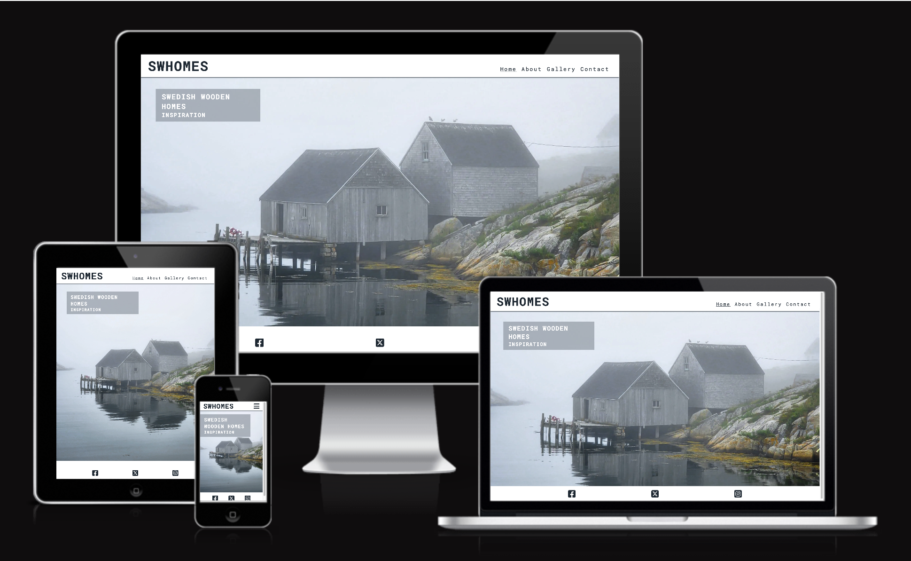

---

## CONTENTS

- [Swedish Wooden Homes](#swedish-wooden-homes)
  - [CONTENTS](#contents)
  - [User experience](#user-experience)
    - [Key information of the site](#key-information-of-the-site)
    - [Target audience](#target-audience)
    - [User stories](#user-stories)
      - [Client goals](#client-goals)
      - [First time visitor goals](#first-time-visitor-goals)
      - [Returning visitor goals](#returning-visitor-goals)
      - [Frequent visitor goals](#frequent-visitor-goals)
  - [Design](#design)
    - [Colour scheme](#colour-scheme)
    - [Typography](#typography)
    - [Imagery](#imagery)
    - [Wireframes](#wireframes)
      - [Home](#home)
      - [About](#about)
      - [Gallery](#gallery)
      - [Contact](#contact)
    - [Features](#features)
      - [Navigation bar in header](#navigation-bar-in-header)
      - [Social media icons in footer](#social-media-icons-in-footer)
      - [Home page](#home-page)
      - [About page](#about-page)
      - [Gallery page](#gallery-page)
      - [Contact page](#contact-page)
      - [Future implementations](#future-implementations)
      - [Accessibility](#accessibility)
  - [Technologies used](#technologies-used)
    - [Languages used](#languages-used)
  - [Deployment](#deployment)
    - [Local development](#local-development)
      - [How to clone](#how-to-clone)
      - [How to fork](#how-to-fork)
  - [Testing](#testing)
    - [CSS validation](#css-validation)
    - [HTML validation](#html-validation)
    - [Performance](#performance)
    - [Accessibility](#accessibility-1)
    - [Manual testing](#manual-testing)
  - [Credits](#credits)
    - [Code used](#code-used)
    - [Content](#content)
    - [Media](#media)
    - [Acknowledgments](#acknowledgments)

---

## User experience

### Key information of the site

- What are the latest home design
- How to become a data base contributor and take part.
- A way for people to locate and contact the site owners.

### Target audience

The target audience is architects, designers and people interested in architecture and design. The website is basic with beautiful images, a short description of the intent of the page. It also has a contact page for visitors to upload their projects and contribute to the content of the site. Links to social media platforms.

### User stories

#### Client goals

- To be able to view the site on a range of device sizes.
- To make it easy for potential users to find out what the swhomes site is and how to take part.
- To allow people to be able to contact the swhomes to ask further questions.

#### First time visitor goals

- Find out what swhomes is.
- Be able to navigate the site easily to find information.
- Be able to find swhomes social media profile.

#### Returning visitor goals

- Find up to date information on latest Swedish architecture tendencies.
- Be able to easily contact swhomes with questions.

#### Frequent visitor goals

- Be able to upload projects.

---

## Design

### Colour scheme

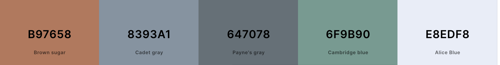 

The website uses a palette of pastel colours that are often used in the swhomes images. The colour palette was created using the [Coolors](https://coolors.co/) website.

### Typography

Google Fonts was used for the Roboto Mono, it is used for the entire site. It is a sans-serif font. It was chosen as it looked clean and modern.

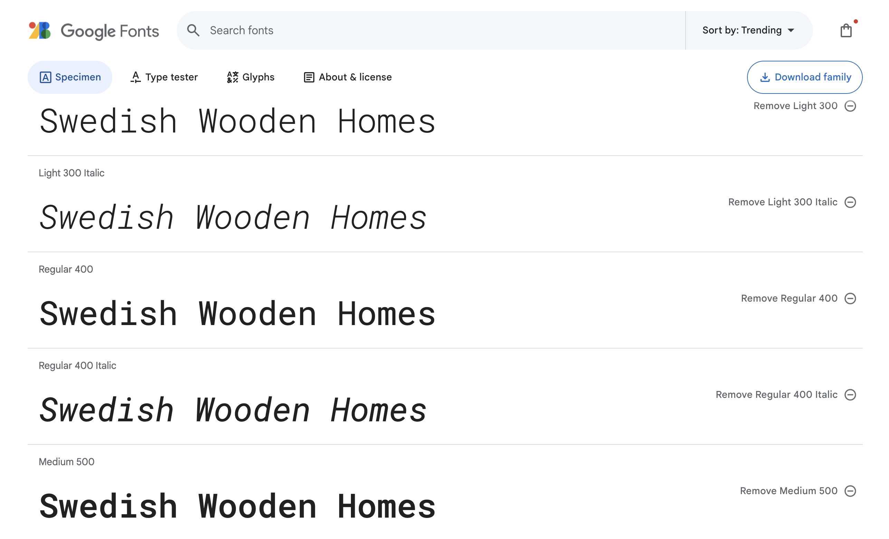

### Imagery

The home and contact images were taken from Pexels.com. All gallery images were taken from archdaily.com. I have credited these in the [Credits](#Credits) section.
All images were compressed through imagify.io and some formats were changed using cloudconvert.com. Chosen images are by random artists and were picked solely based on the style of the business product.

### Wireframes

Wireframes were created for mobile and desktop. The wireframes were generates using balsamic, and the images were modified with canvas.

#### Home

 

#### About

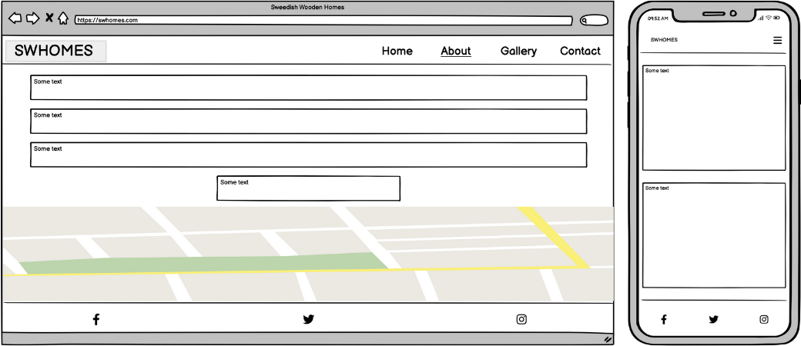 

#### Gallery

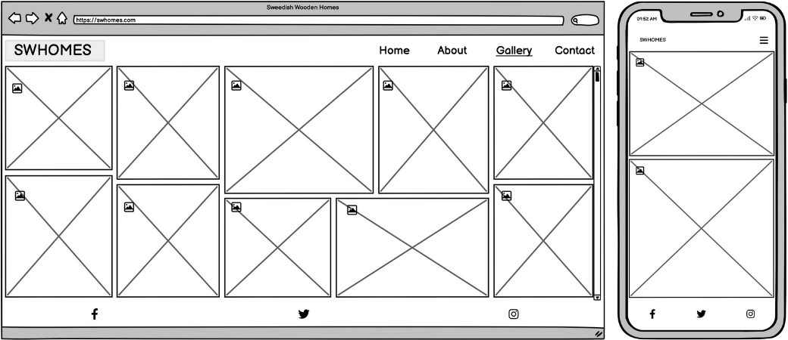 

#### Contact

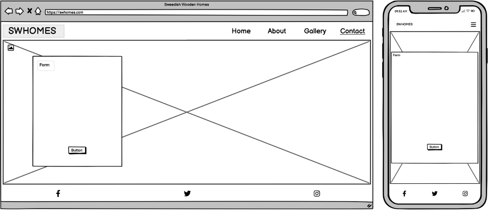 

### Features

#### Navigation bar in header

This website is comprised of four pages, all of them are accessible from the navigation menu. The full responsive navigation bar includes links from the name of the web (SWHome) to the Home page, and links to each of the four pages, Home, About, Gallery and Contact, and is identical in each page to allow for easy navigation.

The navigation bar is located in the upper right corner and for smaller screens it is responsive becoming a hamburger menu. 

This section will allow the user to easily navigate from page to page across all devices without having to revert back to the previous page via the ‘back’ button. 

The active page is underlined to allow easy understanding of where the user is within the website.

Desktop nav bar

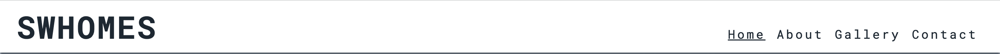

Mobile hamburger nav bar

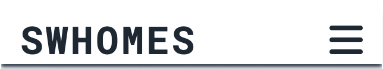

#### Social media icons in footer 

The website includes three social media icons for Facebook, Twitter and Instagram. The icons were sourced from fontawasome.com and its colour was changed to black to fit the colour palette of the website.
  
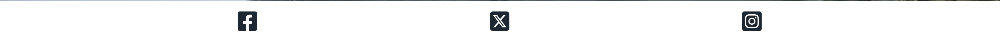

#### Home page

The home page has a Swedish landscape background picture with some text giving the visitor an idea of what he/she is going to find in the website.

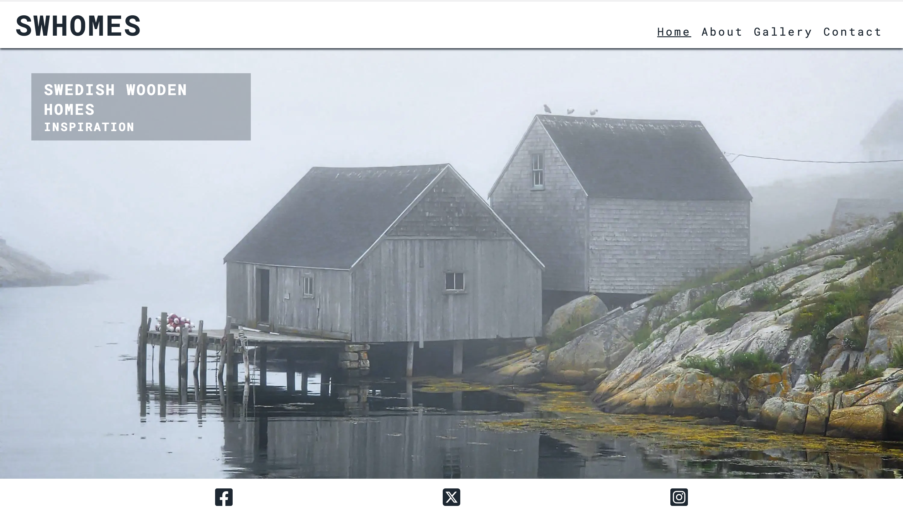

#### About page

The about page introduces what the aim of the website is about and provides contact details for users to communicate with the website owners.

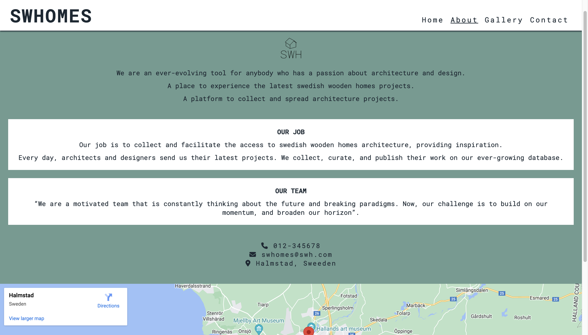 

#### Gallery page

The gallery page provides the images of modern Swedish wooden houses.

#### Contact page

Through the contact page the users can send their architecture projects to be part of the content of SWHomes website.

#### Future implementations

Overall performance of the website can be improved as some parts of the site are slowing it down. Links to the full projects can be added to the gallery section to provide a more complete experience. Newest Architecture technologies could also be included as well as information on materials and interior design. Unfortunately, this type of addition required more technical knowledge.

#### Accessibility

Alt-labels are used for images. Aria-labels for screen readers are implemented at certain places, also semantic elements are used so the page is easy to navigate.

## Technologies used

**GitHub** – storage and deployment 
**Codeanywhere** – IDE used to write, edit, commit and push the code to GitHub 
**Google Fonts** – import font 
**Imagify Image-resizer** – compress images 
**Cloudconvert Image-converter** - change format of images 
**Font Awesome**- import social media and contact icons 
**Favicon Generator Website** – convert logo 
**Balsamiq** – wireframes design 
**Am I Responsive?** – check responsiveness of the website 
**Google Maps** – embed map location 
**Python** - python 3 via terminal to preview my site using a local http server 
**HTML5** - build the core of the site 
**CSS** - style the website and define fonts and layout 
**Google Chrome** - build and test the website 
**Logo logo-generator** - generate logo image 

### Languages used

- HTML 
- CSS 
- Javascript

## Deployment

The site was deployed to GitHub pages.
The project was developed in CodeAnywhere application where it was committed and pushed to GitHub where it was deployed.
The live link can be found here - https://judit3.github.io/swhomes/

### Local development

#### How to clone

1. Log into your account on github
2. Go to the repository of this project, Judit3/swhomes
3. Click on the code button, and copy your preferred clone link.
4. Open the terminal in your code editor and change the current working directory to the location you want to use for the cloned directory.
5. Type 'git clone' into the terminal, paste the link you copied in step 3 and press enter.

#### How to fork

To fork the repository:

1. Log in (or sign up) to Github.
2. Go to the repository for this project, Judit3/swhomes
3. Click the Fork button in the top right corner.

## Testing

### CSS validation

The CSS code was validated using W3C tool.
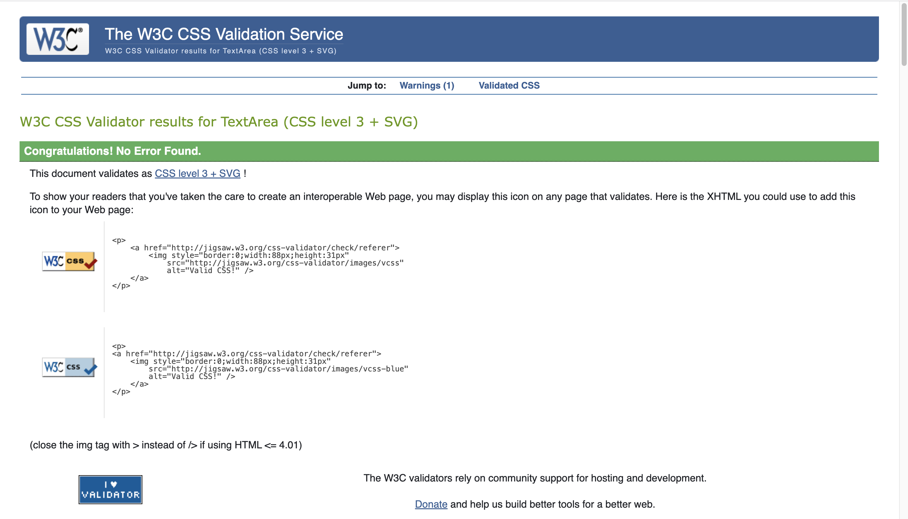

### HTML validation

Every page of the website was validated using the W3C tool.
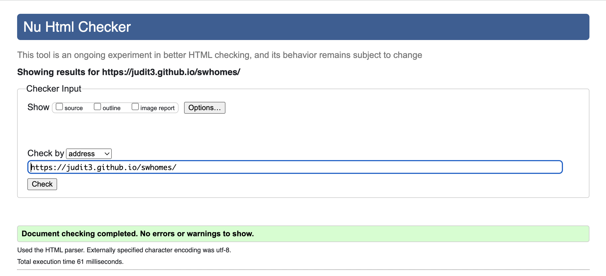
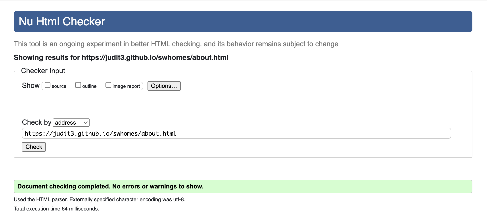
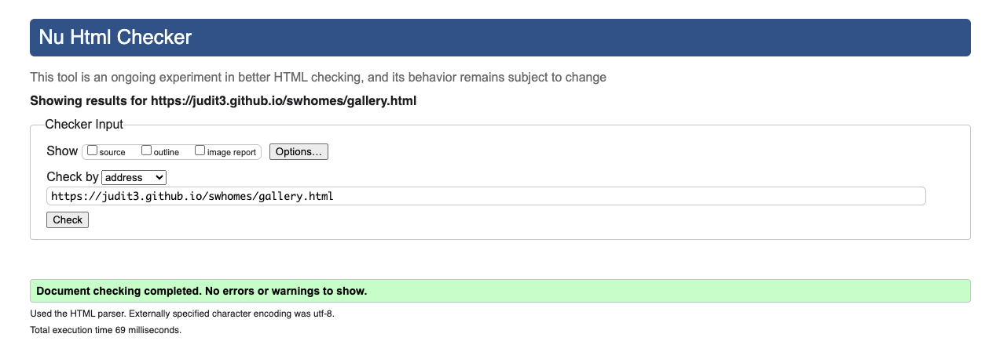
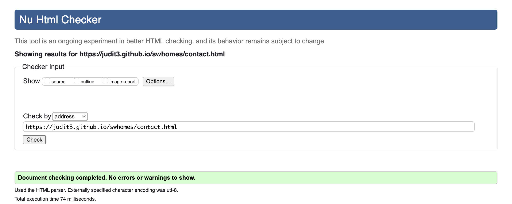

### Performance

Website performance was checked with Lighthouse tool.
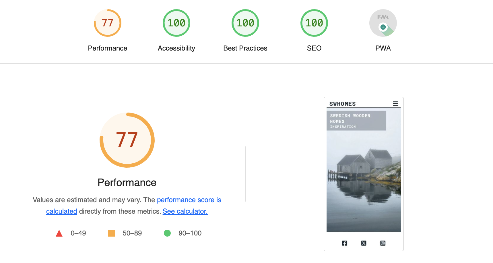

### Accessibility

To check accessibility the Wave Web Accessibility Evaluation tool was used. 
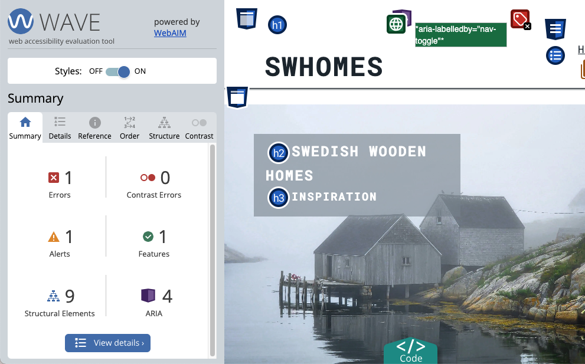

### Manual testing

Manual testing was done to check common elements and how the perform on different devices:

1.	Clicking on the Navbar links brings the user to according page
2.	Clicking on website name (SWHomes) brings the user to the Home page
3.	The responsiveness of the Home page
4.	The responsiveness of the About page
5.	Clicking on View Larger Map button of the map brings the user to correct location.
6.	Clicking on the Social Media icons brings the user to correctly allocated Social Media pages
7.	The responsiveness of the Gallery page
8.	The responsiveness of the Contact page
9.	Filling out the form user must fill in all fields in order to be able to submit and upload files

Following devices and browsers were used:

Laptop:

* Macbook Pro 

Mobile Devices:

* iPhone SE
  
Browsers:

* Google Chrome
* Safari

## Credits

### Code used

1.	The Navigation bar code was used from Love Running Project Challenge
2.	Gallery section code was used from Love Running Project Challenge
3.	Contact form with validation was created from w3schools.com and Love Running Project Challenge
4.	The rest of the code was borrowed and modified mostly from w3schools.com, developer.mozilla.org and Love Running Project Challenge

### Content

All content was written and created by the developer with inspiration from other Codeinstitute student projects.

### Media

Images were downloaded from royalty free website pexels.com (<https://www.pexels.com>) and archdaily.com (www.archdaily.com)

  
### Acknowledgments

My mentor Luke for continuous support and helpful feedback.