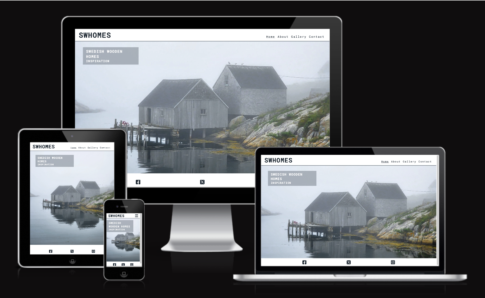

# Swedish Wooden Homes

This is a site for architects and anyone interested in house design, where they will have access to the latest Swedish wooden houses images to get inspiration from.

In this section, you will include one or two paragraphs providing an overview of your project. Essentially, this part is your sales pitch. At this stage, you should have a name for your project so use it! Don’t introduce the project as a Portfolio project for the diploma. In this section, describe what the project hopes to accomplish, who it is intended to target and how it will be useful to the target audience. 

For example; Love Running is a site that hopes to help keep people motivated to meet up for runs on a regular basis in Dublin, Ireland. The site will be targeted toward runners who are looking for a way to socialise and keep themselves fit. Love Running will be useful for runners to see exactly when and where they should be to join the running club. 

