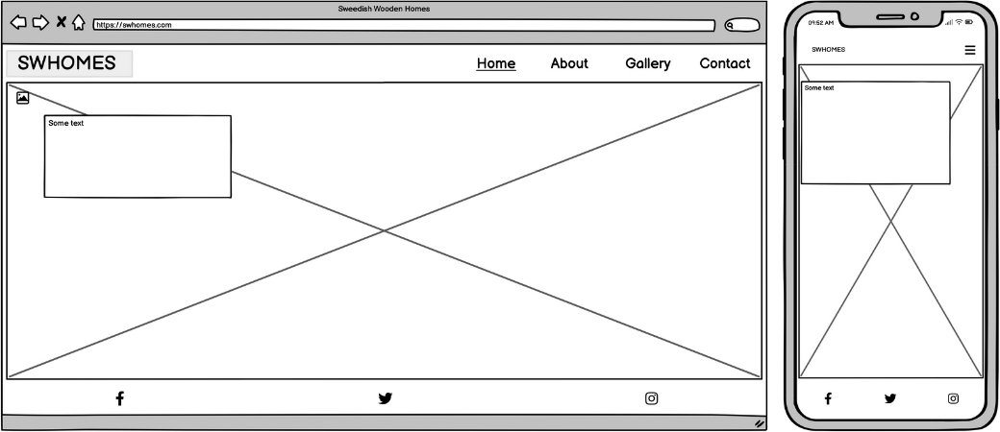

# Swedish Wooden Homes

This is a site for architects and anyone interested in house design, where they will have access to the latest Swedish wooden houses images to get inspiration from. It is being created and an example of website for architecture business mainly. The website was designed to be user-friendly, functional and responsive across all devices. This website was built as a first project of the program to become a Full Stack Software Development at Code Institute. The requirement was to build a static front-end site to present useful information to users, using HTML5 and CSS3.

---

# CONTENTS

- [Swedish Wooden Homes](#swedish-wooden-homes)
- [CONTENTS](#contents)
- [User experience](#user-experience)
  - [Key information of the site](#key-information-of-the-site)
  - [Target Audience](#target-audience)
  - [User stories](#user-stories)
    - [Client Goals](#client-goals)
    - [First Time Visitor Goals](#first-time-visitor-goals)
    - [Returning Visitor Goals](#returning-visitor-goals)
    - [Frequent Visitor Goals](#frequent-visitor-goals)
- [Design](#design)
  - [Colour Scheme](#colour-scheme)
  - [Typography](#typography)
  - [Imagery](#imagery)
  - [Wireframes](#wireframes)
    - [Home](#home)
    - [About](#about)
    - [Gallery](#gallery)
    - [Contact](#contact)
  - [Features](#features)
    - [Nav](#nav)
  - [Accesibility](#accesibility)
- [Tecnologie used](#tecnologie-used)

---

# User experience

## Key information of the site

- What are the latest home design
- How to become a data base contributor and take part.
- A way for people to locate and contact the site owners.

## Target Audience

The target audience is architects, designers and people interested in architecture and design. The website is basic with beautiful images, a short description of the intent of the page. It also has a contact page for visitors to upload their projects and contribute to the content of the site. Links to social media platforms.

## User stories

### Client Goals

- To be able to view the site on a range of device sizes.
- To make it easy for potential users to find out what the swhomes site is and how to take part.
- To allow people to be able to contact the swhomes to ask further questions.

### First Time Visitor Goals

- Find out what swhomes is.
- Be able to navigate the site easily to find information.
- Be able to find swhomes social media profile.

### Returning Visitor Goals

- Find up to date information on latest Swedish architecture tendencies.
- Be able to easily contact swhomes with questions.

### Frequent Visitor Goals

- Be able to upload projects.

---

# Design

## Colour Scheme

  

The website uses a palette of pastel colours that are often used in the swhomes images. The colour palette was created using the [Coolors](https://coolors.co/) website.

## Typography

Google Fonts was used for the Roboto Mono, it is used for the entire site. It is a sans-serif font. It was chosen as it looked clean and modern.

  

## Imagery

The home and contact images where taken from Pexels.com. All gallery images were taken from archDaily.com. I have credited these in the [Credits](#Credits) section.
All images were compressed through imagify.io. Chosen images are by random artists and were picked solely based on the style of the business product.

## Wireframes

Wireframes were created for mobile and desktop. The wireframes were generates using balsamic, and the images were modified with canvas.

### Home

  

### About

  

### Gallery

  

### Contact

  

## Features

### Navigation bar in header

This website is comprised of four pages, all of them are accessible from the navigation menu. The full responsive navigation bar includes links from the name of the web (SWHome) to the Home page, and links to each of the four pages, Home, About, Gallery and Contact, and is identical in each page to allow for easy navigation.

The navigation bar is located in the upper right corner and for smaller screens it is responsive becoming a hamburger menu. 

This section will allow the user to easily navigate from page to page across all devices without having to revert back to the previous page via the ‘back’ button. 

The active page is underlined to allow easy understanding of where the user is within the website.

Desktop nav bar

Movile hamburger nav bar

### Social media icons in footer 

The website includes three social media icons for Facebook, Twitter and Instagram. The icons were sourced from fontawasome.com and its color was changed to black to fit the color pallette of the website.

## Accesibility

# Tecnologie used
